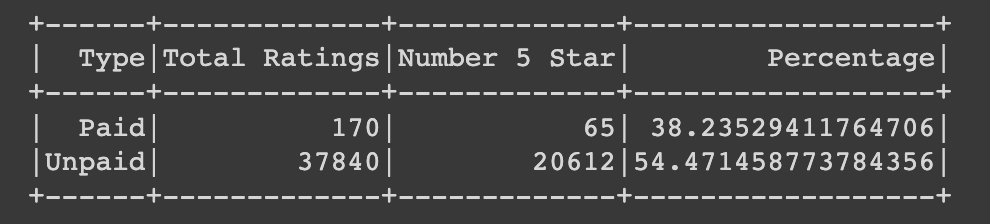

# Amazon Vine Analysis for Pet Products

## Overview
The purpose of this analysis is to assess how paid Vine reviews compared to non-Vine (unpaid) reviews. Sellers will hope for the highest ratings possible (5 stars), and paying for Vine reviews would only be beneficial to them if these reviews are good. 
For each category the total number of reviews, number of 5 star reviews, and percentage of total were calculated. 

## Results
The results are compiled in the following dataframe.

- There were 170 Vine reviews and 37,840 non-Vine reviews.
- 65 Vine reviews were 5 star, while 20,612 non-Vine reviews were.
- Therefore 38.2% of Vine reviews and 54.5% of non-Vine reviews were 5 star ratings. 

## Summary
